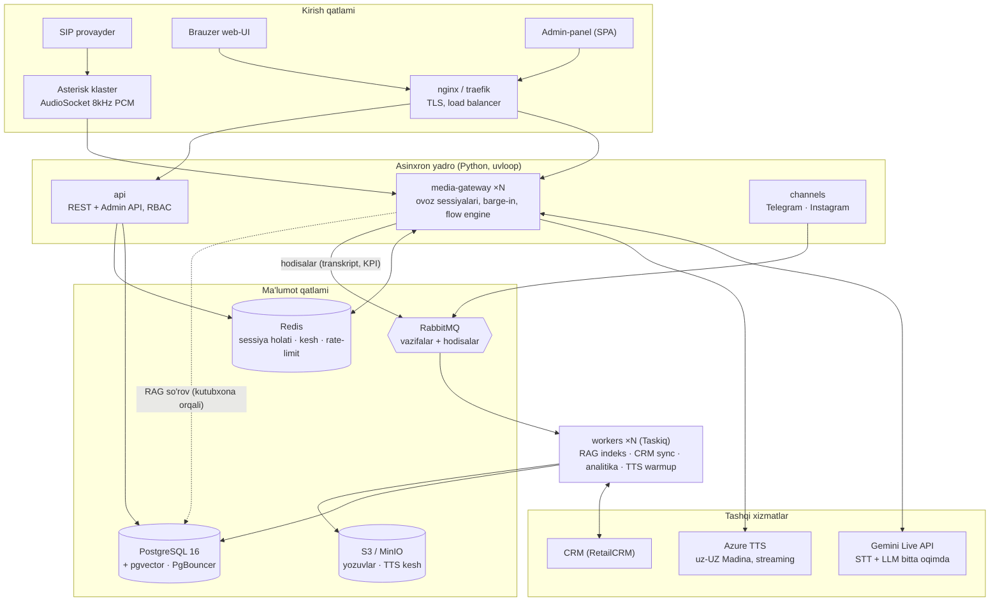
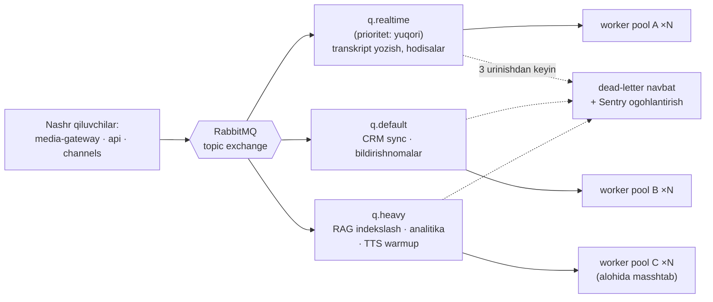
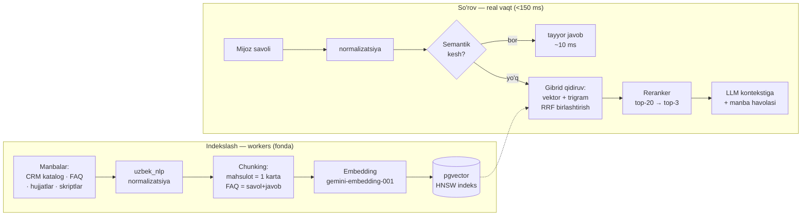

# VoiceAI Platforma — Tizim Arxitekturasi (v1.0)

> O'zbek tilidagi ovozli AI call-center: 100 000+ mijoz, to'liq asinxron yadro, RAG bilimlar
> bazasi va shartnoma SLA'siga (≤1.5 s) mos ovoz konveyeri uchun fayl arxitekturasi va
> texnologik qarorlar.
>
> **Sana:** 2026-07-19 · **Maqom:** tasdiqlashga tayyor · **Asos:** VoIpTelefoniya prototipi + STRATIX (`ai-chatbot`) auditi
> · **Onlayn versiya (dizayn bilan):** https://claude.ai/code/artifact/4642fd2b-c90c-4be3-aacb-d6c161d7fd98

---

## 01 · Umumiy arxitektura

Platforma — **monorepo ichida 4 ta mustaqil deploy qilinadigan servis** va ular baham
ko'radigan kutubxonalar to'plami. Mikroservis "hayvonot bog'i" ham emas, monolit ham emas:
har servis o'z masshtablash profiliga ega bo'lgani uchungina ajratilgan.

- **media-gateway** — ovoz yadrosi. Uzoq yashaydigan ulanishlar (AudioSocket/WebSocket),
  har pod yuzlab parallel sessiya. Alohida, chunki uni REST API'dan boshqacha masshtablaymiz.
- **api** — REST + Admin API. Stateless, oddiy gorizontal masshtab.
- **workers** — og'ir/fon ishlar (RAG indekslash, CRM sinxron, analitika). Navbat uzunligiga
  qarab masshtablanadi.
- **channels** — Telegram/Instagram matn kanallari.



**Muhim tamoyil:** media-gateway hech qachon bazaga sinxron yozmaydi. Qo'ng'iroq davomida
faqat Redis (sessiya holati) va tashqi AI xizmatlari bilan ishlaydi; transkript, KPI,
yozuvlar — hodisa sifatida RabbitMQ'ga ketadi, workers keyin bazaga yozadi. Shu tufayli ovoz
yo'lida hech qanday sekin I/O yo'q.

---

## 02 · Texnologiya tanlovi

| Qatlam | Tanlov | Nega aynan bu (muqobillar bilan) |
|---|---|---|
| Til / runtime | Python 3.12+, asyncio, uvloop | AI SDK'lar birinchi navbatda Python; mavjud prototip kodi shu tilda. uvloop event-loop'ni ~2x tezlashtiradi. *Muqobil: Go (media qatlam uchun keyin)* |
| API framework | FastAPI + Pydantic v2 + Dishka DI | Async-native, OpenAPI avtomatik, DI bilan test oson. *Muqobil: Litestar (yetuklik pastroq)* |
| Fon worker | **Taskiq** + RabbitMQ broker | Yagona *haqiqiy async-native* tanlov: worker ichida `await` to'g'ridan-to'g'ri, FastAPI'dagidek DI, scheduler, retry, DLQ. *Celery — prefork/sync, async yadro bilan yomon (STRATIX'da ham shunday). arq — faqat Redis. Dramatiq — sync.* |
| Navbat / hodisa shinasi | RabbitMQ (quorum queues) | Durable navbatlar, prioritet, dead-letter, topic exchange — vazifa ham, hodisa ham bitta brokerda. *Kafka — ortiqcha ops; Redis Streams — DLQ/ack zaifroq* |
| Baza | PostgreSQL 16 + asyncpg + SQLAlchemy 2 (async) + Alembic | Tranzaksiya, JSONB (flow ta'riflari), full-text/trigram — bitta bazada. PgBouncer bilan ulanish puli. |
| Vektor qidiruv | **pgvector** (HNSW) | Millionlab vektorga yetadi; backup/tranzaksiya bitta bazada. Retriever abstraksiyasi orqali — kerak bo'lsa Qdrant'ga ko'chish 1 modul. *Qdrant/Milvus — bu bosqichda alohida klaster boqish asossiz* |
| Kesh / sessiya | Redis 7 | Sessiya holati (media-gateway stateless bo'lishi uchun), semantik kesh, rate-limit, pub/sub. |
| Telefoniya | Asterisk + AudioSocket; katta masshtabda oldiga Kamailio | AudioSocket — sodda TCP/PCM protokol. STRATIX tajribasi tasdiqladi; transport abstraksiyamizga mos. *FreeSWITCH — jamoada tajriba yo'q; LiveKit — WebRTC og'ish* |
| STT + LLM | Gemini Live API (native audio, bitta WebSocket) | Kaskadga qaraganda ~5x kam kechikish — prototipda isbotlangan (~1–1.5 s). Session resumption + reconnect tayyor. *Kaskad — STRATIX'da 5–10 s bergan* |
| TTS | Azure uz-UZ (streaming) + **ibora keshi**; fallback: Yandex SpeechKit | TTFB ~150–250 ms, talaffuz-normalizatsiya pipeline tayyor. Top-iboralar oldindan sintez → 0 ms, 0 so'm. *uzbekvoice.ai — bloklovchi, 2–3 s (auditda isbotlangan)* |
| Obyekt saqlash | S3-mos (MinIO / bulut S3) | Qo'ng'iroq yozuvlari, TTS keshi, eksportlar. |
| Admin frontend | React + Vite (SPA) + TypeScript | Panel auth ortida — SSR keraksiz. Flow-muharrir uchun React Flow. *Next.js — ortiqcha qatlam* |
| Kuzatuv | OpenTelemetry + Prometheus + Grafana + Loki + Sentry | SLA'ni (latency p50/p95, barge-in, muvaffaqiyat %) dashboard'da isbotlash — shartnoma qabuli uchun ham. |
| Deploy | Docker Compose → (P4'da) Kubernetes | Boshlanishda bitta VPS; masshtabda K8s — imijlar bir xil. |

---

## 03 · Fayl arxitekturasi (monorepo)

Tamoyillar: **servislar faqat `libs/` orqali gaplashadi** (bir-birining ichki kodiga
kirmaydi); domen mantig'i framework'dan ajratilgan; hozirgi prototip kodi (pipeline,
normalize, TTS) deyarli o'zgarishsiz `media_gateway` va `uzbek_nlp`ga ko'chadi.

```text
voiceai-platform/
├── pyproject.toml                # uv workspace — butun monorepo bitta lock bilan
├── uv.lock
├── Makefile                      # dev/test/deploy qisqa buyruqlar
├── docker-compose.yml            # lokal dev: barcha servislar + pg + redis + rabbit
├── .env.example
│
├── libs/                         # ═══ UMUMIY KUTUBXONALAR (har servis ishlatadi) ═══
│   ├── common/                   # config (pydantic-settings), structlog + OTel,
│   │                             #   xatolar, JWT/RBAC primitivlari
│   ├── domain/                   # sof biznes modellar: Tenant, Call, Flow, Product,
│   │                             #   Order, Customer + domen hodisalari (framework yo'q!)
│   ├── db/                       # SQLAlchemy async modellari, repozitoriylar,
│   │   └── migrations/           #   alembic migratsiyalar — bitta joyda
│   ├── uzbek_nlp/                # ★ bizning boylik: talaffuz-normalizatsiya
│   │   ├── normalize.py          # raqam→so'z, lotin↔kirill, orfoepiya (tayyor kod)
│   │   ├── apostrophe.py         # oʻ/gʻ/tutuq unifikatsiyasi
│   │   └── lexicon/              # talaffuz lug'atlari — tenant bo'yicha, DB'dan
│   ├── rag/                      # retrieval kutubxonasi (06-bo'limga qarang)
│   │   ├── chunking.py           # mahsulot kartasi / Q+A / hujjat bo'laklari
│   │   ├── embedding.py          # provayder abstraksiyasi + kesh
│   │   ├── retriever.py          # gibrid: pgvector + trigram + RRF
│   │   ├── reranker.py
│   │   ├── semantic_cache.py     # Redis'da takroriy savollar
│   │   └── evaluator.py          # golden-set sifat o'lchovi (CI'da yuradi)
│   └── messaging/                # Taskiq broker wiring, hodisa sxemalari, outbox
│
├── services/                     # ═══ DEPLOY QILINADIGAN 4 SERVIS ═══
│   │
│   ├── api/                      # REST + Admin API (FastAPI, stateless)
│   │   └── src/api/
│   │       ├── main.py
│   │       ├── middlewares/      # auth, rate-limit, request-id, CORS
│   │       └── v1/
│   │           ├── auth/         # login, token yangilash
│   │           ├── admin/        # xodimlar, rollar, huquqlar (RBAC)
│   │           ├── flows/        # ★ flow CRUD — vizual muharrir backendi
│   │           ├── numbers/      # telefon raqam ↔ scenariy bog'lash
│   │           ├── products/     # katalog/narx boshqaruvi (CRM bilan sync)
│   │           ├── knowledge/    # RAG hujjatlari CRUD + qayta indekslash
│   │           ├── calls/        # yozuvlar, transkriptlar, qidiruv
│   │           ├── analytics/    # KPI, SLA hisobotlari
│   │           └── webhooks/     # CRM, to'lov provayderlari
│   │
│   ├── media_gateway/            # ★ OVOZ YADROSI — hozirgi prototip shu yerga o'sadi
│   │   └── src/media_gateway/
│   │       ├── main.py           # AudioSocket TCP server + WS server, graceful shutdown
│   │       ├── transports/       # manba abstraksiyasi — bitta interfeys:
│   │       │   ├── base.py       #   AudioTransport protokoli (read/write/hangup)
│   │       │   ├── audiosocket.py#   Asterisk (8kHz PCM ↔ resample)
│   │       │   └── browser_ws.py #   web-UI WebSocket (hozirgi server.py)
│   │       ├── pipeline/
│   │       │   ├── session.py    # bitta qo'ng'iroq: holat, taymerlar, yakun
│   │       │   ├── live_llm.py   # Gemini Live: reconnect, resumption, receive-loop
│   │       │   ├── vad.py        # RMS + webrtcvad, end-of-speech 300ms
│   │       │   ├── barge_in.py   # uzish mantig'i (maqsad: <300ms)
│   │       │   ├── latency.py    # SLA instrumentatsiya — har javob o'lchanadi
│   │       │   └── tts/
│   │       │       ├── azure.py  # streaming sintez (tayyor kod)
│   │       │       ├── yandex.py # fallback provayder
│   │       │       └── cache.py  # ibora keshi: S3'dan 0ms javob
│   │       ├── dialog/
│   │       │   ├── flow_engine.py# ★ JSON-flow interpretatori — flow KOD EMAS, DATA
│   │       │   ├── llm_agent.py  # erkin savollar: RAG + tool calling
│   │       │   ├── tools/        # search_products, create_order, transfer_call
│   │       │   └── state.py      # sessiya holati Redis'da (pod o'lsa ham davom etadi)
│   │       └── audio/            # resample, G.711, ulaw — sof funksiyalar
│   │
│   ├── workers/                  # OG'IR ISHLAR — Taskiq, to'liq async
│   │   └── src/workers/
│   │       ├── app.py            # broker, navbatlar, o'rta qatlamlar
│   │       ├── rag_ingest/       # hujjat → chunk → embed → pgvector
│   │       ├── crm_sync/         # katalog/buyurtma ikki tomonlama sinxron
│   │       ├── transcripts/      # qo'ng'iroq hodisalari → DB + S3
│   │       ├── analytics/        # KPI agregatlar, SLA hisobot (kunlik cron)
│   │       ├── tts_warmup/       # top-iboralarni oldindan sintez qilish
│   │       ├── notifications/    # Telegram/SMS ogohlantirishlar
│   │       └── schedules.py      # cron jadval bitta faylda
│   │
│   └── channels/                 # Telegram (aiogram) + Instagram — matn kanallari,
│                                 #   o'sha flow_engine + RAG'ni qayta ishlatadi
│
├── admin-web/                    # React + Vite SPA: flow-muharrir (React Flow),
│                                 #   mahsulot/narx, transkriptlar, KPI, RBAC
│
├── infra/
│   ├── docker/                   # har servisga alohida Dockerfile
│   ├── compose/                  # dev / stage / prod compose fayllari
│   ├── asterisk/                 # pjsip, extensions, ARI konfiglar
│   ├── nginx/
│   ├── monitoring/               # prometheus, grafana dashboardlar, loki, alertlar
│   └── k8s/                      # P4 bosqichida: helm chartlar
│
├── tests/
│   ├── unit/                     # libs + servislar bo'yicha
│   ├── integration/              # compose ichida: navbat, DB, pipeline
│   ├── load/                     # locust — 2000 parallel qo'ng'iroq simulyatsiyasi
│   └── sla/                      # ★ 100-dialog SLA harness — shartnoma metodikasi
│                                 #   (sintetik ovoz bilan, prototipda texnika tayyor)
└── docs/
    ├── architecture.md
    ├── adr/                      # qaror yozuvlari (nega Taskiq, nega pgvector...)
    └── runbooks/                 # avariya yo'riqnomalari (99.9% uptime uchun)
```

> **Kalit qaror:** dialog stsenariylari (flow) — Python kodi emas, **bazada saqlanadigan
> JSON**. Admin-paneldagi vizual muharrir uni tahrirlaydi, `flow_engine` ijro etadi.
> STRATIX'ning eng katta xatosi — "yangi mahsulot qo'shish = kod tahrirlash" — shu bilan
> yechiladi, va shartnomadagi "mijoz to'liq mustaqilligi" talabi bajariladi.

---

## 04 · Ovoz yadrosi va kechikish byudjeti

Shartnoma SLA: o'rtacha **≤1.5 s**, maksimum 2.5 s. Byudjet komponentlarga taqsimlanadi va
har biri alohida o'lchanadi (`latency.py`):

| Bosqich | Byudjet |
|---|---|
| VAD — gap tugadi-detektsiya | 300 ms |
| Gemini Live — birinchi token | ~500 ms |
| Normalizatsiya (uzbek_nlp) | <5 ms |
| Azure TTS — birinchi audio bayt (TTFB) | ~200 ms |
| Tarmoq uzatish | ~100 ms |
| **Jami p50** | **≈1100 ms → SLA 1500 ms ✓ (zaxira ~400 ms)** |

- **Ibora keshi**: salomlashuv, tasdiqlash kabi top-iboralar S3'dan tayyor oqadi — bu
  javoblar uchun TTS qatlami 0 ms.
- **Barge-in**: VAD signal → TTS to'xtatish + Live'ga interrupt — maqsad <300 ms
  (SLA 500 ms, zaxira bilan).
- Kaskad fallback (Google STT → LLM → TTS) faqat Gemini Live uzilganda ishga tushadigan
  zaxira rejim sifatida pipeline'da abstraktsiyalangan.

---

## 05 · Worker qatlami (og'ir ishlar)

Yadro hech qachon og'ir ish qilmaydi — hammasi navbat orqali. **Taskiq** tanlandi, chunki u
async-native: worker ichida `await` bilan DB/HTTP chaqiruvlar to'g'ridan-to'g'ri, Celery'dagi
thread-pool hiylalarisiz.



- **Uch navbat, uch pool**: og'ir RAG indekslash hech qachon transkript yozishni to'sib
  qo'ymaydi — pool'lar alohida masshtablanadi.
- **Outbox pattern**: api bazaga yozganda hodisa avval shu tranzaksiyada outbox jadvalga
  tushadi, keyin brokerga — hodisa yo'qolmaydi.
- **Idempotentlik**: har vazifa kaliti bilan — qayta urinish dublikat buyurtma yaratmaydi.
- **DLQ + alert**: 3 marta yiqilgan vazifa dead-letter'ga, Sentry'ga signal — jimgina
  yo'qolish yo'q.

---

## 06 · RAG dizayni — "sezilarli natija" uchun

O'zbek tili agglyutinativ (qo'shimchalar ko'p: "uzuk / uzug'i / uzuklardan") va ikki
alifboli. Oddiy vektor qidiruv bunda ko'p adashadi — shuning uchun **gibrid qidiruv
majburiy**, ixtiyoriy emas.



Natijani *sezilarli* qiladigan 6 qaror:

1. **Gibrid + RRF**: vektor qidiruv ma'noni topadi ("nikoh uzugi" ≈ "to'y uzugi"), trigram
   esa aniq nom/artikul/narxni — ikkalasi RRF bilan birlashadi.
2. **Normalizatsiya ikki tomonda**: indekslashda ham, so'rovda ham bir xil `uzbek_nlp` —
   kirill yozgan mijoz lotin hujjatni topadi.
3. **Strukturali chunking**: mahsulot = bitta yaxlit karta (nom + narx + tavsif +
   atributlar), FAQ = savol-javob jufti. "Sahifani 500 tokendan kesish" degan naiv usul yo'q.
4. **Semantik kesh**: call-center savollarining katta qismi takror ("yetkazish qancha?") —
   Redis'dan ~10 ms'da, LLM'siz.
5. **Yangilik kafolati**: CRM'da narx o'zgardi → webhook → worker shu kartani qayta
   indekslaydi. RAG hech qachon eski narx aytmaydi.
6. **O'lchanadigan sifat**: 200 ta real savoldan golden-set; har o'zgarishda `evaluator`
   hit-rate'ni o'lchaydi — "yaxshilandi shekilli" emas, raqam bilan.

---

## 07 · 100 000+ mijoz uchun masshtab hisobi

100k mijoz ≠ 100k parallel qo'ng'iroq. Erlang baholash: band soatda mijozlarning ~5%
qo'ng'iroq qilsa (5000 qo'ng'iroq/soat) va o'rtacha suhbat 3 daqiqa bo'lsa — **~250 parallel
sessiya**. Loyihani 8x zaxira bilan **2000 parallelga** (shartnoma ko'rsatkichi)
mo'ljallaymiz:

| Komponent | Sig'im birligi | 2000 parallel uchun | Masshtab strategiyasi |
|---|---|---|---|
| media-gateway | ~200 sessiya/pod | 10 pod | Gorizontal; sessiya holati Redis'da — pod almashsa qo'ng'iroq davom etadi |
| Asterisk | ~700 kanal/instans | 3 instans | Oldiga Kamailio SIP dispatcher; raqamlar bo'yicha taqsimlash |
| PostgreSQL | — | 1 primary + 1 replica | PgBouncer puli; o'qishlar replicaga; calls jadvali oy bo'yicha partitsiya |
| Redis | — | master + replica | Sentinel; kerak bo'lsa cluster rejim |
| RabbitMQ | — | 3-node klaster | Quorum queues — node yiqilsa navbat yo'qolmaydi |
| workers | navbatga qarab | 3–10 pod | Navbat uzunligi metrikasi bo'yicha autoscale |
| api / channels | — | 2–3 pod | Stateless, nginx orqasida round-robin |

Tashqi limitlar ham hisobda: Gemini Live va Azure TTS parallel sessiya kvotalari — provayder
bilan oldindan kelishiladi (yoki bir nechta API kalit puli). Bu 10-podli konfiguratsiya
birinchi kundan kerak emas: **xuddi shu kod 1 podda ham ishlaydi** — masshtab konfiguratsiya
masalasi bo'lib qoladi, arxitektura masalasi emas.

---

## 08 · Ishonchlilik va xavfsizlik

- **99.9% uptime** = oyiga 43 daqiqa xato byudjeti. Buning uchun: graceful shutdown (yangi
  qo'ng'iroq qabul qilmay, borini tugatish), health-check + auto-restart, Gemini Live
  reconnect (prototipda tayyor), TTS fallback provayder.
- **SLA isboti**: `tests/sla/` — 100 ta sintetik dialog harness (prototipda ishlatgan
  sintetik-ovoz texnikasi asosida) + Grafana'da real-vaqt p50/p95 dashboard. Shartnoma
  qabuli raqam bilan himoyalanadi.
- **Sirlar**: .env emas — Docker/K8s secrets; repo'da hech qanday kalit yo'q (STRATIX
  auditidagi xatolar takrorlanmaydi: token/parollar kodda ochiq yotgan edi).
- **RBAC**: rollar (egasi, administrator, operator, kuzatuvchi) API darajasida; har amal
  audit-logga.
- **Ma'lumot**: kunlik PG backup + S3 versiyalash; shaxsiy ma'lumotlar shifrlangan diskda;
  O'zR "Shaxsiy ma'lumotlar to'g'risida"gi qonunga mos saqlash.
- **Tarmoq**: TLS hamma joyda, SIP uchun IP-ACL, rate-limit har kanalda.

---

## 09 · Yo'l xaritasi — prototipdan platformaga

| Bosqich | Mazmun | Natija |
|---|---|---|
| **P1 · Skelet** | Monorepo yaratish; mavjud kodni ko'chirish: pipeline → `media_gateway`, normalize → `uzbek_nlp`; DB/Redis/Rabbit compose'da | Hozirgi funksionallik yangi strukturada, testlar bilan |
| **P2 · Telefoniya + Flow** | AudioSocket transport; `flow_engine` (JSON-flow); birinchi real qo'ng'iroq; Taskiq + transkript worker | Telefon orqali ishlaydigan bot, stsenariy data'da |
| **P3 · RAG + Admin** | RAG konveyeri + golden-set; admin API + SPA (flow-muharrir, mahsulotlar, transkriptlar); CRM sync | Mijoz mustaqil boshqaradigan tizim — shartnoma 5-bandi |
| **P4 · Masshtab** | Kuzatuv to'liq (OTel+Grafana), load-test 2000 parallel, SLA harness, K8s/ko'p-instans | Shartnoma SLA raqam bilan isbotlangan, 100k+ tayyor |

---

*VoiceAI Platforma · arxitektura hujjati v1.0 · 2026-07-19 · Staff tizim dizayni*
