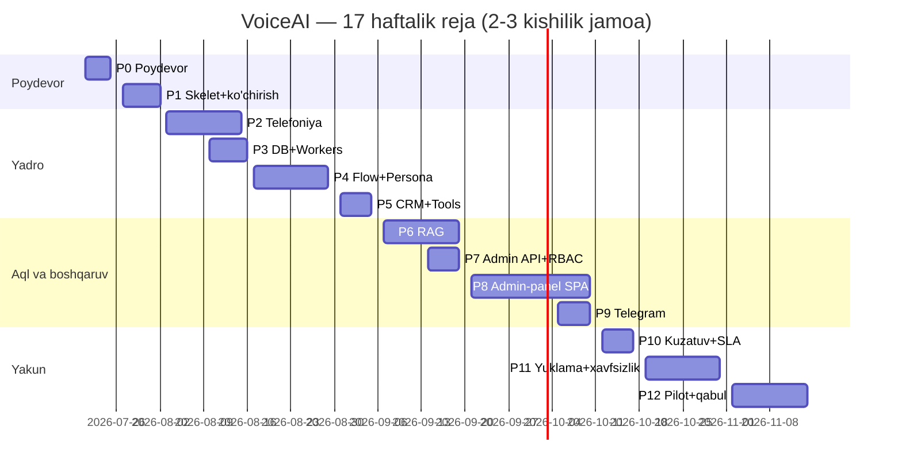

# VoiceAI Platforma — To'liq Ishlab Chiqarish Rejasi (v1.0)

> **Maqsad:** ARXITEKTURA.md dagi tizimni 100% professional, optimal va aniq ishlaydigan
> holatga yetkazish. STRATIX (`ai-chatbot`) loyihasidan foydali qismlarni olgan holda,
> sotuvchi botning xulqini admin-panel orqali yaratish imkoniyati bilan.
>
> **Sana:** 2026-07-19 · **Davomiylik:** ~17 hafta (2–3 kishilik jamoa) · **Go-live:** ~2026-11-13
> · **Bog'liq hujjat:** [ARXITEKTURA.md](ARXITEKTURA.md)

---

## 0. Kerakli soha mutaxassislari (rollar)

Har ishga rol belgilangan — "kim qilishi kerak" emas, "qaysi sohaning bilimi kerak" ma'nosida
(bitta odam bir nechta rolni bajarishi mumkin):

| Belgi | Rol | Mas'uliyat sohasi |
|---|---|---|
| **BE** | Backend muhandis (Python async) | Servislar, DB, workers, API |
| **VOIP** | Telefoniya muhandisi | Asterisk, SIP, AudioSocket, audio sifat |
| **AI** | AI/ML muhandis | Gemini Live, TTS, RAG, prompt/persona, sifat o'lchovi |
| **FE** | Frontend muhandis | Admin-panel (React), flow-muharrir, UX |
| **QA** | Sifat muhandisi | Test strategiya, avtotestlar, SLA harness, UAT |
| **DevOps** | DevOps/SRE | Docker/K8s, CI/CD, monitoring, xavfsizlik, backup |
| **PM** | Loyiha boshqaruvchisi | Reja, qabul mezonlari, mijoz bilan aloqa, risklar |

---

## 1. STRATIX loyihasidan NIMANI OLAMIZ va nimani olmaymiz

### Olamiz (tekshirilgan, ishlaydigan qismlar)

| Nima | Qayerdan | Qayerga |
|---|---|---|
| Asterisk konfiglari (pjsip, extensions, AudioSocket dialplan, IP-ACL) | `asterisk/etc/` | `infra/asterisk/` |
| ARI klient (REST + WebSocket) | `src/ari/` | `services/media_gateway` (kerak bo'lsa) |
| RetailCRM klient patternlari (search word-map, order yaratish) | `src/services/ai/crm_service.py`, `tools.py` | `services/api` + `libs/` |
| STT xato-regex darslari ("uzuga", "takan", to'g'ri/tograt...) | `order_flow.py` | flow_engine parserlar + `uzbek_nlp` |
| FAQ + "nudge" patterni (javob + holatga mos undov) | `order_flow.py` | flow_engine |
| VAD / shovqin filtri g'oyalari, 8kHz frame pacing (0.018s!) | `vad_service.py`, `noise_filter.py`, `call_pipeline.py` | `media_gateway/pipeline` |
| DB jadval g'oyalari (call_session, conversations, faqs) | `src/models/` | `libs/db` sxemasi |
| Telegram bot skeleti (aiogram) | `src/telegram_bot/` | `services/channels` |
| Real test-qo'ng'iroq metodikasi (log-tahlil formati) | `PROGRESS.md` | QA jarayoni |

### Olmaymiz (isbotlangan muammolar)

- ❌ uzbekvoice.ai bloklovchi STT/TTS (2–4 s kechikish — SLA buzadi) → bizda Gemini Live + Azure streaming
- ❌ Kodga qotirilgan katalog va stsenariy (Python tahrirlash = mijoz qaram) → flow/persona DATA bo'ladi
- ❌ Repo ichida ochiq sirlar (tokenlar, parollar) → secrets boshqaruvi
- ❌ Sync Celery uslubidagi yondashuvlar → Taskiq async
- ❌ Bitta katta `call_pipeline.py` (67KB monolit fayl) → modulli pipeline

---

## 2. Test strategiyasi (butun loyiha bo'ylab)

Har faza o'z qabul testlariga ega, lekin umumiy piramida:

1. **Unit** (har PR'da, CI) — sof funksiyalar: normalize, parserlar, flow node'lar, chunking. Maqsad: yadro modullarda ≥80% qamrov.
2. **Integratsion** (har PR'da, compose ichida) — DB, navbat, pipeline bo'g'inlari real xizmatlar bilan.
3. **Dialog golden-testlar** (kunlik) — sintetik ovoz harness: Azure Sardor ovozi "mijoz" bo'lib gapiradi, bot javoblari tekshiriladi (prototipda texnika tayyor va isbotlangan).
4. **E2E** (har release'da) — Playwright: admin-panel → sozlash → test qo'ng'iroq → natija.
5. **Yuklama** (P11) — 2000 parallel sessiya, chaos-testlar.
6. **SLA harness** (P10'dan boshlab doimiy) — shartnoma metodikasi: 100 ketma-ket dialog, p50/p95 latency, barge-in, muvaffaqiyat %.
7. **UAT** (P12) — real foydalanuvchilar bilan qabul.

**Umumiy Definition of Done (har ish uchun):** kod review'dan o'tgan · testlari yozilgan va
yashil · CI yashil · hujjat/runbook yangilangan · metrika/log qo'shilgan · staging'da tekshirilgan.

---

## 3. Fazalar

> Har faza oxiridagi **Chiqish mezoni** bajarilmaguncha keyingi fazaga o'tilmaydi
> (parallel belgilanganlar bundan mustasno).

---

### P0 · Poydevor (4 kun) — DevOps, PM

**Maqsad:** bir buyruq bilan ko'tariladigan dev-muhit va CI.

| # | Ish | Rol |
|---|---|---|
| 0.1 | Monorepo skeleti: uv workspace, `libs/` + `services/` strukturasi (ARXITEKTURA.md bo'yicha) | BE |
| 0.2 | `docker-compose.yml`: postgres+pgvector, redis, rabbitmq, minio | DevOps |
| 0.3 | CI (GitHub Actions): ruff + mypy + pytest, har PR'da | DevOps |
| 0.4 | Secrets siyosati: .env faqat lokal, repo'da hech qanday kalit yo'q, pre-commit secret-scan | DevOps |
| 0.5 | ADR jurnali boshlash (nega Taskiq, nega pgvector — arxitekturadan) | PM |

**Qabul testlari:**
- [ ] `make up` — barcha infra konteynerlar bitta buyruqda ko'tariladi, `make down` toza tushiradi
- [ ] Ataylab kalit qo'shilgan test-commit CI'da rad etiladi (secret-scan ishlaydi)
- [ ] Bo'sh PR'da CI 5 daqiqadan tez yashil bo'ladi

**Chiqish mezoni:** yangi dasturchi 30 daqiqada muhitni ko'tara oladi (README bo'yicha).

---

### P1 · Skelet + prototipni ko'chirish (1 hafta) — BE, AI

**Maqsad:** hozirgi ishlab turgan funksionallik yangi strukturada, hech narsa yo'qolmagan.

| # | Ish | Rol |
|---|---|---|
| 1.1 | `libs/uzbek_nlp`: normalize/apostrof/raqam kodini ko'chirish + mavjud 27 unit testni ko'chirish | AI |
| 1.2 | `libs/common`: config (pydantic-settings), structlog, xato ierarxiyasi | BE |
| 1.3 | `media_gateway`: pipeline ko'chirish — `live_llm.py` (Gemini Live + receive-loop fix + resumption), `tts/azure.py`, `vad.py`, `latency.py` | AI |
| 1.4 | `transports/browser_ws.py`: hozirgi web-UI transporti + `base.py` AudioTransport protokoli | BE |
| 1.5 | `api` skeleti: healthz, versiya, OpenAPI | BE |
| 1.6 | Talaffuz lug'ati (`talaffuz.txt` mantiqasi) DB-tayyor interfeysga o'tkazish (hozircha fayl backend) | AI |

**Qabul testlari:**
- [ ] Barcha ko'chirilgan unit testlar yashil (normalize: 27+ test)
- [ ] **Regressiya:** web orqali 5 daqiqalik suhbat — eski prototip bilan bir xil sifat: barge-in ishlaydi, latency har javobda logda, uzilishda auto-reconnect
- [ ] 3-turlik sintetik dialog testi o'tadi (deafness-bug regressiyasi — bizning eski xato qaytmasligi)
- [ ] `latency` hodisalari strukturali logda ko'rinadi (keyin Grafana uchun)

**Chiqish mezoni:** eski `VoIpTelefoniya` repo muzlatiladi (faqat o'qish), barcha ish yangi monorepo'da.

---

### P2 · Telefoniya (2 hafta) — VOIP, BE

**Maqsad:** telefon orqali birinchi to'laqonli suhbat.

| # | Ish | Rol |
|---|---|---|
| 2.1 | Asterisk konteyner + STRATIX konfiglarini moslash (pjsip, extensions, AudioSocket dialplan, IP-ACL) | VOIP |
| 2.2 | `transports/audiosocket.py`: TCP server, UUID'dan raqam ajratish, 8kHz↔16kHz resample, 0.018s frame pacing (STRATIX darsi) | BE |
| 2.3 | Sessiya hayot sikli: javob berish, tugatish (hangup), maksimal davomiylik, jimlik timeout | BE |
| 2.4 | Barge-in telefon yo'lida: VAD → TTS stop → Live interrupt | AI |
| 2.5 | Softphone (Zoiper/MicroSIP) bilan ichki test raqami | VOIP |
| 2.6 | SIP provayder tanlash va shartnoma (real raqam) — parallel boshlanadi | PM |

**Qabul testlari:**
- [ ] Softphone'dan qo'ng'iroq → bot salomlashadi, 5+ almashinuvli suhbat, mijoz tugatadi — toza hangup
- [ ] Bot javob berayotganda gapirib yuborilsa — bot **≤500 ms**da jim bo'ladi (logdagi o'lchov bilan isbot)
- [ ] 10 ketma-ket qo'ng'iroq — hammasi muvaffaqiyatli, ovoz sifati qoniqarli (8kHz eshitib baholanadi)
- [ ] 2 parallel qo'ng'iroq — bir-biriga xalaqit yo'q (sessiya izolyatsiyasi)
- [ ] media-gateway restart paytida: yangi qo'ng'iroqlar qabul qilinmaydi, boridagilar tugashiga ruxsat (graceful shutdown testi)
- [ ] Latency telefon yo'lida ham har javobda o'lchanadi

**Chiqish mezoni:** telefon orqali barqaror suhbat + latency o'lchovlari yig'ilmoqda.

---

### P3 · Ma'lumotlar qatlami + Workers (1 hafta, P2 bilan qisman parallel) — BE, DevOps

**Maqsad:** hamma narsa yozib boriladi, og'ir ishlar navbatda.

| # | Ish | Rol |
|---|---|---|
| 3.1 | PG sxema v1: tenants, users/roles, numbers, flows, personas, products, calls, transcripts, knowledge, audit_log (Alembic) | BE |
| 3.2 | Taskiq + RabbitMQ wiring: 3 navbat (realtime/default/heavy), retry, DLQ, idempotency kaliti | BE |
| 3.3 | Outbox pattern (api tranzaksiyasidan hodisa yo'qolmasligi) | BE |
| 3.4 | `transcripts` worker: media-gateway hodisalari → DB + audio S3'ga | BE |
| 3.5 | Sentry ulash (barcha servislar) | DevOps |

**Qabul testlari:**
- [ ] Qo'ng'iroq tugagach ≤5 s ichida transkript DB'da, audio S3'da
- [ ] RabbitMQ node o'chirilib yoqilganda navbatdagi vazifalar yo'qolmaydi (durability test)
- [ ] Ataylab yiqiladigan vazifa: 3 urinish → DLQ → Sentry'da ogohlantirish ko'rinadi
- [ ] Bitta hodisa 2 marta yuborilsa — DB'da dublikat yo'q (idempotency test)
- [ ] Migratsiya rollback testi: `alembic downgrade` ma'lumot yo'qotmaydi

**Chiqish mezoni:** ovoz yo'lida DB chaqiruvi YO'Q ekani kod-review bilan tasdiqlangan.

---

### P4 · Flow Engine + Persona (2 hafta) — AI, BE

**Maqsad:** bot xulqi va stsenariylari — kod emas, boshqariladigan data.

| # | Ish | Rol |
|---|---|---|
| 4.1 | Flow JSON sxemasi: node turlari — `say`, `ask` (slot + validator), `branch`, `faq`, `tool`, `llm_fallback`, `transfer`, `end`; retry limitlar; versiyalash | AI |
| 4.2 | `flow_engine.py` interpretatori + Redis'da sessiya holati | BE |
| 4.3 | **Persona modeli** (bot xulqi): ism, xarakter tavsifi, muloqot uslubi bloklari, taqiqlar ("jonim/azizim yo'q" kabi), ovoz sozlamalari (voice/rate/pitch preset), til siyosati — DB'da, versiyalangan | AI |
| 4.4 | Persona → Gemini system prompt kompilyatori (bloklardan yig'iladi) | AI |
| 4.5 | STRATIX darslari: STT xato-regexlar, FAQ+nudge, "3 so'zdan uzun savolli gap ≠ tasdiq" qoidalari — slot parserlarga | AI |
| 4.6 | Raqam ↔ flow ↔ persona bog'lash (bir raqamga bir stsenariy) | BE |
| 4.7 | Rol shablonlari: **Sotuvchi / Servis / Informator** (shartnoma talabi) — 3 tayyor persona + flow shablon | AI |

**Qabul testlari:**
- [ ] Har node turi uchun unit test (jami ≥30 test)
- [ ] **Golden dialog to'plami** (sintetik ovoz harness): 10 stsenariy — to'liq buyurtma, FAQ bilan bo'lingan buyurtma, qaytariladigan mijoz, tushunarsiz javoblar (retry), rad etish — hammasi kutilgan holat o'tishlari bilan
- [ ] Flow DB'da o'zgartirilganda — restart YO'Q, keyingi qo'ng'iroq yangi flow bilan (hot-reload testi)
- [ ] Persona o'zgartirilganda (masalan uslub bloki) — keyingi qo'ng'iroqda xulq real o'zgargani eshitib tasdiqlanadi
- [ ] 3 rol shabloni bilan bitta raqamda rejim almashtirish ishlaydi
- [ ] STT xato-regressiya to'plami: "uzuga", "tograt", "o'n oltin", "takan" kabi 20 ta buzuq kirish to'g'ri parse qilinadi

**Chiqish mezoni:** stsenariy yoki xulqni o'zgartirish uchun kod yozish KERAK EMAS.

---

### P5 · CRM + Tools (1 hafta) — BE

**Maqsad:** buyurtma real CRM'da yaratiladi, ishonchli.

| # | Ish | Rol |
|---|---|---|
| 5.1 | CRM klient (RetailCRM, STRATIX patternlari: word-map qidiruv) — timeout, retry, circuit-breaker bilan | BE |
| 5.2 | Tools: `search_products`, `create_order`, `transfer_call` — flow'dan ham, LLM'dan ham chaqiriladi | BE |
| 5.3 | Buyurtma worker orqali (navbatda) — TTS javobni bloklamaydi | BE |
| 5.4 | CRM webhook qabul qilish (narx/katalog o'zgarishi) | BE |

**Qabul testlari:**
- [ ] Sintetik dialog → sandbox CRM'da to'g'ri buyurtma (mahsulot, narx, yetkazish, mijoz ma'lumoti)
- [ ] CRM ataylab o'chirilganda: bot yiqilmaydi, mijozga muloyim javob, buyurtma navbatda qoladi va CRM qaytganda yaratiladi
- [ ] Bir tasdiqlashdan ikkita buyurtma chiqmaydi (idempotency)
- [ ] CRM javobi >2 s kechiksa — bot kutish iborasi bilan vaqt yutadi

**Chiqish mezoni:** 20 sintetik buyurtmadan 20 tasi CRM'da to'g'ri.

---

### P6 · RAG (2 hafta) — AI, BE

**Maqsad:** bilimga asoslangan, o'lchanadigan sifatli javoblar.

| # | Ish | Rol |
|---|---|---|
| 6.1 | Ingest worker: manba → uzbek_nlp normalizatsiya → strukturali chunking (mahsulot=karta, FAQ=juft) → embedding → pgvector HNSW | AI |
| 6.2 | Gibrid retriever: vektor + pg_trgm, RRF birlashtirish | AI |
| 6.3 | Semantik kesh (Redis) + kesh invalidatsiya | BE |
| 6.4 | Reranker bosqichi (top-20 → top-3) | AI |
| 6.5 | **Golden-set:** 200 real savol (STRATIX transkriptlari + mijoz FAQ'idan) + `evaluator` CI'da | QA |
| 6.6 | CRM sync: webhook → o'sha kartani qayta indekslash | BE |
| 6.7 | Knowledge API: hujjat yuklash/o'chirish/qayta indekslash | BE |

**Qabul testlari:**
- [ ] Golden-set: **top-3 hit-rate ≥85%**, javob to'g'riligi (spot-check 50 ta) ≥90%
- [ ] Kirillcha savol lotin hujjatni topadi va aksincha (10 juft test)
- [ ] CRM'da narx o'zgartirilgach ≤60 s ichida bot yangi narxni aytadi
- [ ] Semantik kesh: takror savol ≤20 ms, hit-rate loglarda ko'rinadi
- [ ] Retrieval real vaqtda ≤150 ms (p95) — latency byudjetga sig'adi
- [ ] Bot bilmagan savolda to'qimaydi — "aniqlashtirib olaman" + operator/qayta aloqa yo'li

**Chiqish mezoni:** RAG sifati raqam bilan o'lchangan va CI'da har o'zgarishda qayta o'lchanadi.

---

### P7 · Admin API + RBAC (1 hafta, P6 bilan parallel) — BE

**Maqsad:** panel uchun to'liq, xavfsiz backend.

| # | Ish | Rol |
|---|---|---|
| 7.1 | Auth: JWT + refresh, parol siyosati | BE |
| 7.2 | RBAC: egasi / administrator / operator / kuzatuvchi — endpoint darajasida | BE |
| 7.3 | CRUD: flows (versiyalash + rollback), personas, products, numbers, knowledge | BE |
| 7.4 | Calls API: ro'yxat, filtr, transkript, audio URL (S3 presigned) | BE |
| 7.5 | Analytics API: KPI agregatlar (qo'ng'iroqlar, muvaffaqiyat, latency, konversiya) | BE |
| 7.6 | Audit log: har yozuv amali kim-qachon-nima | BE |

**Qabul testlari:**
- [ ] Huquq matritsasi avtotesti: har rol × har endpoint — kutilgan 200/403 (jadval bilan)
- [ ] Operator flow o'zgartira olmaydi, kuzatuvchi faqat o'qiydi
- [ ] Flow rollback: eski versiyaga qaytarish → keyingi qo'ng'iroq eski flow bilan
- [ ] Audit logda test-amallar to'liq ko'rinadi
- [ ] OpenAPI hujjati to'liq — FE shundan ishlay oladi

**Chiqish mezoni:** FE ishni faqat API hujjati bilan boshlay oladi (savol-javobsiz).

---

### P8 · Admin-panel SPA (3 hafta) — FE, AI (persona UX), QA

**Maqsad:** mijoz mustaqil boshqaradigan panel — shartnomaning eng muhim talabi.

| # | Ish | Rol |
|---|---|---|
| 8.1 | Login, layout, rol-asosli navigatsiya | FE |
| 8.2 | Dashboard: bugungi qo'ng'iroqlar, muvaffaqiyat %, latency, konversiya | FE |
| 8.3 | **Flow-muharrir** (React Flow): vizual node'lar, shartli tarmoqlanish (flow branching), maqsadlar (lid/buyurtma), raqamga biriktirish | FE |
| 8.4 | **Persona Studio** (bot xulqi yaratish): xarakter bloklari (ism, yosh, uslub, taqiqlar), ovoz sozlamalari (preset + jonli tinglash tugmasi), rol tanlash (Sotuvchi/Servis/Informator), **playground** — matnda va ovozda sinab ko'rish, versiyalash/rollback | FE+AI |
| 8.5 | Mahsulotlar/narxlar boshqaruvi + CRM sync holati | FE |
| 8.6 | Qo'ng'iroqlar: ro'yxat, transkript o'qish, audio tinglash, baho qo'yish | FE |
| 8.7 | Bilimlar bazasi: hujjat yuklash, indekslash holati | FE |
| 8.8 | Xodimlar va rollar boshqaruvi | FE |

**Qabul testlari:**
- [ ] **E2E (Playwright):** admin yangi flow yaratadi → raqamga bog'laydi → test qo'ng'iroq aynan shu flow bilan ishlaydi
- [ ] **E2E:** Persona Studio'da xulq o'zgartiriladi (masalan "rasmiyroq uslub") → playground'da farq eshitiladi → real qo'ng'iroqda ham
- [ ] Operator roli bilan kirganda tahrirlash tugmalari yo'q (UI + API ikkala qatlamda)
- [ ] Noto'g'ri flow saqlab bo'lmaydi (validatsiya: bog'lanmagan node, cheksiz sikl)
- [ ] UAT checklist: texnik bo'lmagan odam 15 daqiqada yangi mahsulot qo'shib, salomlashuv matnini o'zgartira oladi (yozma yo'riqnomasiz)

**Chiqish mezoni:** shartnoma 5-bo'lim talablari (rollar, flow branching, maqsadlar, turli raqamga turli stsenariy, huquqlar) — har biri UI'da ishlaydi.

---

### P9 · Matn kanallari (1 hafta, P8 bilan parallel) — BE

**Maqsad:** o'sha miya — Telegram'da ham.

| # | Ish | Rol |
|---|---|---|
| 9.1 | Telegram bot (aiogram, STRATIX skeletidan): o'sha flow_engine + RAG + tools | BE |
| 9.2 | Mijoz identifikatsiyasi: telefon + telegram bitta customer profilida | BE |
| 9.3 | Instagram (ixtiyoriy, vaqt qolsa) | BE |

**Qabul testlari:**
- [ ] Telegram'da to'liq buyurtma sikli → CRM'da buyurtma
- [ ] Telefonda boshlagan mijoz telegramda davom etsa — tarix bitta profilda
- [ ] Flow o'zgarishi ikkala kanalga bir xil ta'sir qiladi (bitta manba)

---

### P10 · Kuzatuv + SLA harness (1 hafta) — DevOps, QA

**Maqsad:** har ko'rsatkich ko'rinadi, SLA doimiy o'lchanadi.

| # | Ish | Rol |
|---|---|---|
| 10.1 | OTel trace: qo'ng'iroq → Live → TTS → transport to'liq zanjiri | DevOps |
| 10.2 | Grafana dashboardlar: latency p50/p95, barge-in vaqti, muvaffaqiyat %, navbat uzunligi, tashqi API xatolari | DevOps |
| 10.3 | Alertlar: p95 > 2s (5 daq), xato > 5%, navbat > 1000, disk/mem | DevOps |
| 10.4 | **SLA harness** (`tests/sla/`): 100 ketma-ket sintetik dialog → hisobot (shartnoma 3-bo'lim metodikasi aynan) | QA |
| 10.5 | Loki log agregatsiya + saqlash siyosati | DevOps |

**Qabul testlari:**
- [ ] Ataylab sekinlashtirilgan TTS bilan alert 5 daqiqada keladi (alert drill)
- [ ] SLA harness bitta buyruq bilan yuradi va PDF/MD hisobot chiqaradi: latency o'rtacha/maks, barge-in, muvaffaqiyat %
- [ ] Trace'da bitta qo'ng'iroqning to'liq zanjirini 1 daqiqada topish mumkin
- [ ] Dashboard'siz savolga javob berib bo'lmaydigan holat yo'q ("kecha nechta qo'ng'iroq yiqildi?" — 10 soniyada)

---

### P11 · Yuklama + qattiqlashtirish (2 hafta) — DevOps, QA, BE

**Maqsad:** 2000 parallel va avariyalarga chidamlilik isbotlangan.

| # | Ish | Rol |
|---|---|---|
| 11.1 | Yuklama stend: audio-loopback simulyator (real TTS/Live'siz arzon rejim + kichik ulushda real) | QA |
| 11.2 | Pog'onali test: 100 → 500 → 1000 → 2000 parallel sessiya | QA |
| 11.3 | Chaos: pod o'ldirish (suhbat o'rtasida), RabbitMQ node yiqitish, Redis failover, Gemini kvota tugashi → kaskad fallback | DevOps |
| 11.4 | Xavfsizlik o'tishi: OWASP top-10 (admin API), rate-limit, TLS hamma joyda, secrets audit, SIP fraud himoya | DevOps |
| 11.5 | Backup/restore mashqi: PG + S3 to'liq tiklash | DevOps |
| 11.6 | Narx optimallash: TTS ibora-kesh hit-rate, Gemini token sarfi/daqiqa hisobot | AI |

**Qabul testlari:**
- [ ] 2000 parallel'da p95 latency ≤ 2.5 s, xato ≤ 1%
- [ ] Suhbat o'rtasida pod o'ldirilganda: sessiya Redis'dan tiklanadi yoki mijozga muloyim qayta ulanish — jim uzilish YO'Q
- [ ] RabbitMQ node yiqilganda hodisa yo'qolmaydi (hisob-kitob bilan tekshiriladi)
- [ ] Gemini kvota tugaganda kaskad fallback ishga tushadi, suhbat davom etadi (sifat pastroq, lekin uzilmaydi)
- [ ] Restore mashqi: to'liq tiklanish ≤ 30 daqiqa, ma'lumot yo'qotish ≤ 15 daqiqa (RPO)
- [ ] Pentestcheck-list yopilgan, kritik topilma 0 ta

---

### P12 · Pilot + qabul (2 hafta) — PM, QA, hamma

**Maqsad:** real trafikda isbot va rasmiy qabul.

| # | Ish | Rol |
|---|---|---|
| 12.1 | Staging → production deploy, real SIP raqam ulash | DevOps |
| 12.2 | Ichki UAT: 20 real qo'ng'iroq (jamoa + tanish odamlar), har biri baholanadi | QA |
| 12.3 | Yumshoq ishga tushirish: trafikning kichik qismi botga (qolgani operatorga) | PM |
| 12.4 | **Rasmiy SLA o'lchovi:** 100 ketma-ket real dialog (tanlab olmasdan!) — shartnoma metodikasi | QA |
| 12.5 | Admin foydalanuvchilarni o'qitish (2 soatlik sessiya + video) | PM |
| 12.6 | Runbook'lar yakunlash: avariya stsenariylari, eskalatsiya | DevOps |
| 12.7 | Qabul hujjati: SLA hisobot + UAT natijalar + o'qitish tasdig'i | PM |

**Yakuniy qabul mezonlari (shartnoma bilan aynan):**
- [ ] Latency: o'rtacha **≤1.5 s**, maksimum **≤2.5 s** (100 dialog bo'yicha)
- [ ] Barge-in: **≤500 ms**
- [ ] Texnik muvaffaqiyat: **≥95%** (tizim aybi bilan uzilish/javobsizlik/kritik xato yo'q)
- [ ] Uptime: **≥99.9%** (pilot davrida o'lchangan)
- [ ] Admin mustaqilligi: mijoz vakili yordam so'ramasdan: mahsulot qo'shadi, narx o'zgartiradi, salomlashuvni tahrirlaydi, bot rolini almashtiradi, transkript topib tinglaydi
- [ ] Hujjatlar: arxitektura, runbook, foydalanuvchi qo'llanmasi — topshirilgan

---

## 4. Vaqt jadvali

**Muhim nuqtalar (milestones):**

| Sana | Voqea |
|---|---|
| ~15-avg | 📞 Telefon orqali birinchi barqaror suhbat (P2) |
| ~28-avg | 🎭 Xulq va stsenariy kodsiz boshqariladi (P4) |
| ~18-sen | 🧠 RAG sifati raqam bilan isbotlangan (P6) |
| ~9-okt | 🖥️ Admin-panel to'liq (P8) — shartnoma 5-bo'limi yopiladi |
| ~30-okt | 💪 2000 parallel + chaos testlar o'tgan (P11) |
| **~13-noy** | 🚀 **Go-live: rasmiy SLA o'lchovi bilan qabul (P12)** |

---

## 5. Risklar reestri

| Risk | Ehtimol | Ta'sir | Chora |
|---|---|---|---|
| Gemini Live preview-model o'zgarishi/yopilishi | O'rta | Yuqori | Model nomi konfigda; kaskad fallback (P11); flagship modelga o'tish testi har oyda |
| SIP provayder bilan kechikish (byurokratiya) | O'rta | O'rta | P2'da softphone bilan ish davom etadi; provayder ishini P0'dan boshlash |
| Azure uz-UZ ovoz sifati yetmasligi (aksent) | Past | O'rta | Talaffuz pipeline tayyor; Yandex/ElevenLabs fallback P4'dan keyin har vaqt ulanadi |
| API kvotalar (Live parallel sessiya limiti) | O'rta | Yuqori | P2'da kvota so'rovi; kalit puli; provayder bilan enterprise kelishuv |
| Scope creep (yangi talablar oqimi) | Yuqori | O'rta | Har yangi talab → backlog → faqat faza chegarasida kiradi; PM qo'riqlaydi |
| Jamoa kichikligi (2-3 kishi, rollar ko'p) | Yuqori | O'rta | Fazalar ketma-ketligi shunga moslangan; parallel fazalar faqat rollar to'qnashmasa |
| STRATIX kodidan ko'chirishda yashirin bog'liqliklar | Past | Past | Faqat pattern olamiz, kod emas (asterisk konfigdan tashqari) |

---

## 6. Ish tartibi (PM rituallari)

- **Har kuni:** 15-daqiqalik sinxron (nima qilindi/qilinadi/to'siq).
- **Faza oxiri:** demo + qabul testlari checklist birga yuriladi — hammasi ✅ bo'lmaguncha faza yopilmaydi.
- **Har hafta:** golden-dialog va SLA-mini o'lchov trendlari ko'riladi (sifat orqaga ketmayaptimi).
- **Har PR:** kod review majburiy, CI yashil, DoD checklist.
- **Hujjat:** har arxitektura qarori ADR'ga; har avariya postmortem'ga.

---

*VoiceAI Platforma · ishlab chiqarish rejasi v1.0 · 2026-07-19 · PM: to'liq davr rejasi, 12 faza*
